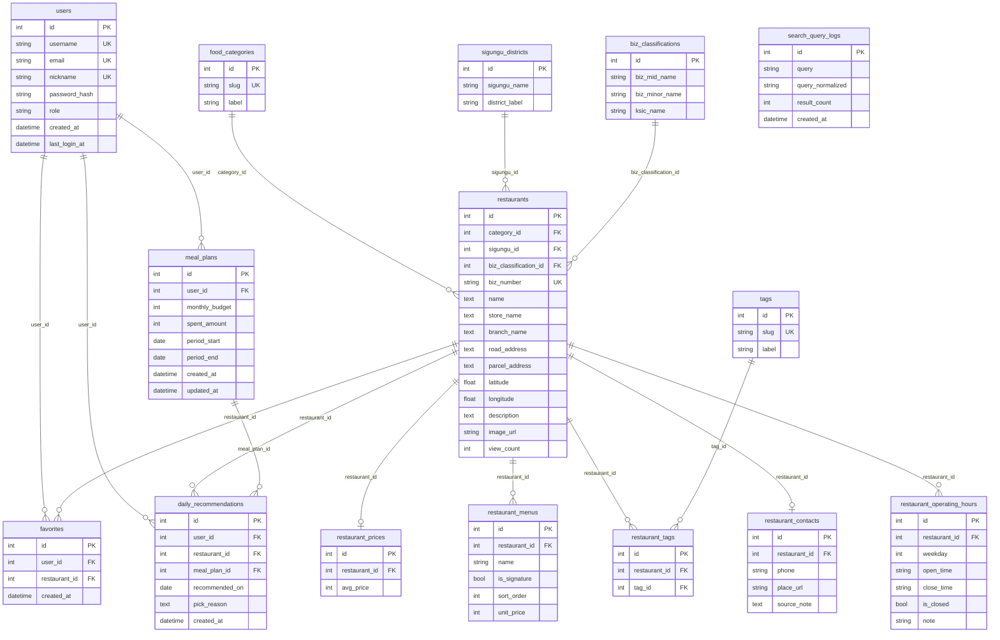
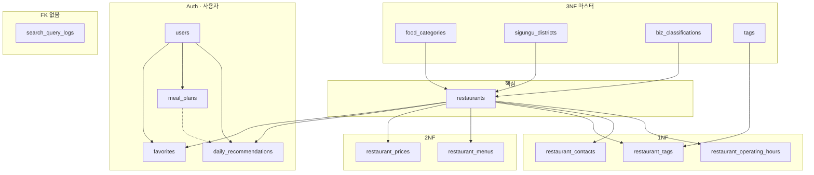

# GourmetMate — RDBMS 스키마·ERD (1NF · 2NF · 3NF)

모듈러 모놀리식 `backend/apps/gourmet` 기준. PK 규칙은 [ENTITY_RULE.md](./ENTITY_RULE.md) (`id` int autoincrement).

**마이그레이션:** `f8a9b0c1d2e3` (2NF) → `b1c2d3e4f5a6` (3NF·1NF 보강)

---

## 0. 현재 DB 스냅샷 (Neon PostgreSQL)

검증: 2026-05-22 · Alembic `b1c2d3e4f5a6`

| 테이블 | 행 수 | 정규형 | 역할 |
|--------|------:|--------|------|
| `restaurants` | 138,558 | 핵심 | 매장 카탈로그 |
| `food_categories` | 8 | 3NF 마스터 | 음식 카테고리 |
| `sigungu_districts` | 428 | 3NF 마스터 | 시군구·동(지역 라벨) |
| `biz_classifications` | 616 | 3NF 마스터 | 공공 업종(중·소·KSIC) |
| `restaurant_prices` | 138,558 | 2NF | 1인 추정 식대 |
| `restaurant_menus` | 138,558 | 1NF | 메뉴(대표 `is_signature`) |
| `tags` | 4 | 3NF 마스터 | AI/주제 태그 사전 |
| `restaurant_tags` | 138,766 | 1NF | 매장–태그 N:M |
| `restaurant_contacts` | 0 | 1NF | 전화·플레이스 URL (보강 API) |
| `restaurant_operating_hours` | 0 | 1NF | 요일별 영업·휴무 |
| `users` | 11 | — | Auth |
| `favorites` | 0 | — | 즐겨찾기 |
| `meal_plans` | 0 | — | 식비 계획 |
| `daily_recommendations` | 1 | — | 일일 추천 |
| `search_query_logs` | 3+ | — | 검색 로그 (FK 없음) |

**ERD 포함 테이블:** 위 15개 전부 (§1). `alembic_version` 은 메타 테이블이라 제외.

**`restaurants`에서 제거된 컬럼:** `district`, `sigungu_name`, `biz_mid_name`, `biz_minor_name`, `ksic_name`, `ai_tags` (JSONB)

**API 호환:** `Restaurant.district`, `sigungu_name`, `biz_*`, `ai_tags` 는 `@property` + 조인으로 동일 필드명 유지.

---

## 1. ERD (전체 — Neon `public` 15테이블)

> Obsidian·GitHub Mermaid 미리보기.  
> **모든 테이블**은 아래 `{ … }` 속성 블록을 가져야 다이어그램에 표시됩니다.  
> `||--o{` = 1:N · `||--o|` = 1:0..1 · FK 없음 = 독립 엔티티



**독립 테이블 (다이어그램 내 FK 선 없음)**

| 테이블 | 이유 |
|--------|------|
| `search_query_logs` | 검색어 집계만, `users`·`restaurants` 미참조 |

---

## 관련 문서

[[whoareryu/_claude/CLAUDE\|Backend CLAUDE]] · [[ENTITY_RULE]] · [[EXTERNAL_API_KEYS]] · [[gourmetmate_v2_erd]]

**복합 UK (관계선에 표기 안 함)** — §3 참고: `uq_favorites_user_restaurant`, `uq_daily_rec_user_date`, `uq_restaurant_tags_pair`, `uq_sigungu_districts_name_label`, `uq_biz_classifications_triple`, `restaurant_prices.restaurant_id`, `restaurant_contacts.restaurant_id`, `uq_restaurant_operating_hours_day`.

---

## 2. 정규형별 설계

### 2.1 1NF (제1정규형) — 반복 그룹 제거

| 이전 | 문제 | 현재 |
|------|------|------|
| `signature_menu` 단일 컬럼 | 메뉴 1:N | `restaurant_menus` (행당 1메뉴) |
| `ai_tags` JSONB 배열 | 태그 반복 그룹 | `tags` + `restaurant_tags` |
| (예정) 영업시간 문자열 | 요일별 다값 | `restaurant_operating_hours` (요일당 1행) |
| (예정) 전화·URL 혼재 | 연락 단일 개념 | `restaurant_contacts` |

### 2.2 2NF (제2정규형) — 부분 종속 제거

| 제거 컬럼 | 종속 대상 | 분리 테이블 |
|-----------|-----------|-------------|
| `category_slug`, `category_label` | `slug` → `label` | `food_categories` |
| `avg_price` | 매장 식대 프로필 | `restaurant_prices` (UK `restaurant_id`) |

PK는 대리 키 `id`만 사용 → 복합키 부분 종속 없음.

### 2.3 3NF (제3정규형) — 이행 종속 제거

| 제거 컬럼 | 이행 종속 | 분리 테이블 |
|-----------|-----------|-------------|
| `district`, `sigungu_name` | 지역 라벨은 매장 id와 무관하게 (시군구, 동) 쌍으로 결정 | `sigungu_districts` |
| `biz_mid_name`, `biz_minor_name`, `ksic_name` | 업종명은 업종 코드 조합에만 종속 | `biz_classifications` |



---

## 3. 관계·UK 요약

| From | To | 카디널리티 | UK / FK |
|------|-----|-----------|---------|
| `food_categories` | `restaurants` | 1:N | `category_id` |
| `sigungu_districts` | `restaurants` | 1:N | `sigungu_id` |
| `biz_classifications` | `restaurants` | 1:N | `biz_classification_id` |
| `restaurants` | `restaurant_prices` | 1:0..1 | `restaurant_id` |
| `restaurants` | `restaurant_menus` | 1:N | — |
| `tags` | `restaurant_tags` | 1:N | — |
| `restaurants` | `restaurant_tags` | 1:N | (`restaurant_id`, `tag_id`) |
| `restaurants` | `restaurant_contacts` | 1:0..1 | `restaurant_id` |
| `restaurants` | `restaurant_operating_hours` | 1:N | (`restaurant_id`, `weekday`) |
| `users` | `favorites` | 1:N | (`user_id`, `restaurant_id`) |
| `users` | `daily_recommendations` | 1:N | (`user_id`, `recommended_on`) |
| `restaurants` | `daily_recommendations` | 1:N | `restaurant_id` |
| `meal_plans` | `daily_recommendations` | 1:N | `meal_plan_id` NULL 허용 |
| — | `search_query_logs` | — | FK 없음 |

---

## 4. 인덱스 (3NF 적용 후)

| 테이블 | 인덱스 | 용도 |
|--------|--------|------|
| `restaurants` | `ix_restaurants_category_sigungu_id` | 카테고리·지역 스캔 |
| `restaurants` | `ix_restaurants_sigungu_id` | 지역 FK 조인 |
| `restaurants` | `ix_restaurants_biz_classification_id` | 업종 필터 |
| `restaurants` | `ix_restaurants_biz_number` UNIQUE | CSV 키 |
| `sigungu_districts` | `ix_sigungu_districts_district_label` | `district` 검색 |
| `restaurant_prices` | `ix_restaurant_prices_avg_price` | 식비 상한 |

---

## 5. ORM · OOP

| 모델 | 파일 |
|------|------|
| `SigunguDistrict` | `models/sigungu_district.py` |
| `BizClassification` | `models/biz_classification.py` |
| `Tag`, `RestaurantTag` | `models/tag.py`, `restaurant_tag.py` |
| `RestaurantContact` | `models/restaurant_contact.py` |
| `RestaurantOperatingHour` | `models/restaurant_operating_hour.py` |

**has-a:** `Restaurant.sigungu`, `.biz_classification`, `.tag_links`, `.contact`, `.operating_hours`

**조회 로딩:** `repositories/restaurant_orm_loads.py` — 카드/상세 시 마스터·태그·연락처 eager load

**CSV 적재:** `CsvRestaurantImporter` — `SigunguDistrictRepository`, `BizClassificationRepository`, `TagRepository` 로 FK 해석

---

## 6. 마이그레이션·적재

```bash
cd backend
alembic upgrade head   # b1c2d3e4f5a6
```

기존 DB(레거시 컬럼 → 3NF 자동 이전):

- `alembic/versions/b1c2d3e4f5a6_normalize_gourmet_3nf.py` — 마스터 backfill, `ai_tags` → `tags`/`restaurant_tags`, 구 컬럼 DROP

신규 CSV 전체 재적재:

```bash
python scripts/import_restaurants_from_csv.py
```

---

## 7. 테이블·컬럼 색인 (ERD 15개 전체)

| # | 테이블 | PK | 주요 FK | UK |
|---|--------|-----|---------|-----|
| 1 | `users` | `id` | — | `username`, `email`, `nickname` |
| 2 | `food_categories` | `id` | — | `slug` |
| 3 | `sigungu_districts` | `id` | — | (`sigungu_name`, `district_label`) |
| 4 | `biz_classifications` | `id` | — | (`biz_mid_name`, `biz_minor_name`, `ksic_name`) |
| 5 | `restaurants` | `id` | `category_id`, `sigungu_id`, `biz_classification_id` | `biz_number` |
| 6 | `restaurant_prices` | `id` | `restaurant_id` | `restaurant_id` |
| 7 | `restaurant_menus` | `id` | `restaurant_id` | — |
| 8 | `tags` | `id` | — | `slug` |
| 9 | `restaurant_tags` | `id` | `restaurant_id`, `tag_id` | (`restaurant_id`, `tag_id`) |
| 10 | `restaurant_contacts` | `id` | `restaurant_id` | `restaurant_id` |
| 11 | `restaurant_operating_hours` | `id` | `restaurant_id` | (`restaurant_id`, `weekday`) |
| 12 | `favorites` | `id` | `user_id`, `restaurant_id` | (`user_id`, `restaurant_id`) |
| 13 | `meal_plans` | `id` | `user_id` | — |
| 14 | `daily_recommendations` | `id` | `user_id`, `restaurant_id`, `meal_plan_id` | (`user_id`, `recommended_on`) |
| 15 | `search_query_logs` | `id` | — | — |
