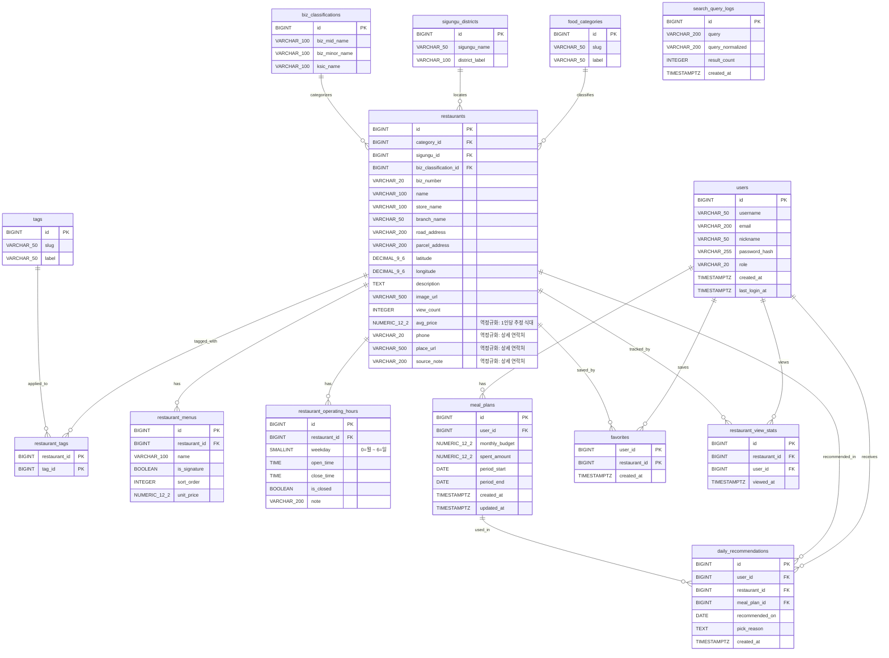

# GourmetMate ERD v2

역정규화 적용 내역:
- `1인당 추정 식대` → `restaurants`에 `avg_price` 컬럼으로 병합
- `상세 연락처` → `restaurants`에 `phone`, `place_url`, `source_note` 컬럼으로 병합
- `AI 일일 맞춤 추천`에서 User 복사 컬럼 제거, FK만 유지
- `즐겨찾기 / 찜`의 PK를 복합 PK(user_id + restaurant_id)로 변경
- `매장-태그 연결 교차`의 PK를 복합 PK(restaurant_id + tag_id)로 변경
- `restaurant_view_stats` 테이블 추가 (ORM 누락분 반영)
- 전체 컬럼 타입을 실제 의미에 맞게 수정

---

## 관련 문서

[[whoareryu/_claude/CLAUDE\|Backend CLAUDE]] · [[GOURMET_ERD]] · [[ENTITY_RULE]] · [[EXTERNAL_API_KEYS]]
